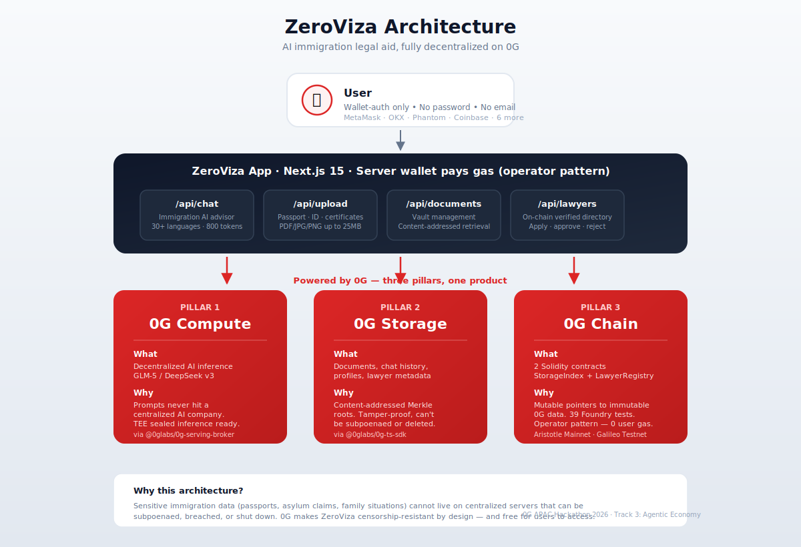

# ZeroViza

> **One-sentence pitch (30 words):** ZeroViza is a decentralized AI immigration advisor built on 0G — free multilingual legal guidance, tamper-proof document storage, and on-chain lawyer verification for the world's 280 million migrants.

**Submission:** 0G APAC Hackathon 2026 · **Track 3** — Agentic Economy & Autonomous Applications
**Live demo:** [zeroviza.vercel.app](https://zeroviza.vercel.app)
**Team:** Divine (solo)

---

**ZeroViza** is a multilingual AI immigration advisor built entirely on **0G decentralized infrastructure**. It gives immigrants, refugees, and international professionals free, confidential AI guidance on visas, asylum, work permits, family reunification, and more — in 30+ languages, with tamper-proof document storage and on-chain verified lawyer credentials.

**No centralized database. No centralized AI. No centralized storage. Everything runs on 0G.**



---

## 0G Integration Proof

ZeroViza integrates **three core 0G pillars** — every piece of data and every AI response flows through 0G:

| 0G Component | How ZeroViza Uses It | Evidence |
|---|---|---|
| **0G Compute** | AI immigration advisor runs inference via `@0glabs/0g-serving-broker`. Server wallet funds compute so users pay nothing. | [`src/lib/0g/compute.ts`](src/lib/0g/compute.ts) |
| **0G Storage** | All user data is content-addressed on 0G Storage via `@0glabs/0g-ts-sdk` — chat history (JSONL), user profiles (JSON), uploaded documents (PDF/images up to 25MB), and lawyer metadata. | [`src/lib/0g/storage.ts`](src/lib/0g/storage.ts) |
| **0G Chain** | Two smart contracts on 0G Galileo: `StorageIndex.sol` (wallet → 0G root hash mapping) and `LawyerRegistry.sol` (on-chain lawyer verification with operator pattern). 39 Forge tests pass. | [`contracts/src/`](contracts/src/) |

### Architecture

```
User (wallet) ──> Next.js App ──> 0G Compute (AI inference)
                       │
                       ├──> 0G Storage (documents, history, profiles)
                       │
                       └──> 0G Chain (StorageIndex + LawyerRegistry contracts)
```

The **operator pattern** lets a server wallet pay for storage and compute on behalf of users — users only need a wallet for identity, not gas. Smart contracts serve as mutable pointers to immutable 0G Storage content. No SQLite, no Postgres, no centralized DB.

### Smart Contracts

**0G Aristotle Mainnet** (hackathon submission)

| Contract | Address | Purpose |
|----------|---------|---------|
| `StorageIndex` | *pending mainnet deploy* — see [`ARCHITECTURE.md`](docs/hackathon/ARCHITECTURE.md#contract-addresses) | Maps wallet → 0G root hashes (history, profile, documents) |
| `LawyerRegistry` | *pending mainnet deploy* | On-chain lawyer verification + metadata URI |

**0G Galileo Testnet** (active development + reviewer testing)

| Contract | Address | Explorer |
|----------|---------|---------|
| `StorageIndex` | `0xbBb868BcA991c8C9e184F236bD7AfAB79e4F602b` | [View on Galileo](https://chainscan-galileo.0g.ai/address/0xbBb868BcA991c8C9e184F236bD7AfAB79e4F602b) |
| `LawyerRegistry` | `0x009158249E904A7089f8649ABb9b9268780E2D9a` | [View on Galileo](https://chainscan-galileo.0g.ai/address/0x009158249E904A7089f8649ABb9b9268780E2D9a) |

Mainnet deploy script: [`contracts/script/DeployMainnet.s.sol`](contracts/script/DeployMainnet.s.sol)

---

## Features

| Feature | Description |
|---------|-------------|
| AI Immigration Advisor | Multilingual AI guided by USCIS, IRCC, UK Home Office, UNHCR, and 29+ destination countries |
| Document Vault | Drag-drop upload to 0G Storage — tamper-proof, content-addressed, verifiable |
| Lawyer Registry | On-chain verified lawyer directory with admin approval/rejection flow |
| Eligibility Quiz | 4-step interactive quiz for instant visa eligibility assessment |
| Document Checklists | Country + visa-type specific document requirement lists |
| Resources Hub | Immigration guides for US, UK, Canada, EU, Australia, UAE, Japan, Nigeria + more |
| Dashboard | Activity graph, daily streak, session stats |
| Demo Mode | Full app preview without a wallet — zero friction onboarding |
| Multilingual | 30+ languages: English, Spanish, French, Arabic, Hindi, Yoruba, Igbo, Hausa, Swahili, Amharic, Tagalog, Farsi, Ukrainian + auto-detect |
| 10+ Wallet Options | MetaMask, OKX, Phantom, Trust, Coinbase, Brave, Rabby, SubWallet, WalletConnect |

---

## Tech Stack

- **Framework**: Next.js 15.5 (App Router), React 19
- **CSS**: Tailwind v4 with `@theme inline` design tokens
- **Auth**: Wagmi v2 + RainbowKit v2 — 0G Galileo (Chain ID 16602)
- **AI**: 0G Compute Network (configurable model — DeepSeek Chat v3 / qwen-2.5-7b)
- **Storage**: `@0glabs/0g-ts-sdk` — content-addressed decentralized file storage
- **Data Layer**: `StorageIndex.sol` + `LawyerRegistry.sol` on 0G Galileo (zero centralized DB)
- **Contracts**: Foundry (Solidity 0.8.24), ethers.js 6.16 integration
- **State**: Zustand + TanStack Query
- **Animation**: Framer Motion

---

## Quick Start

### Prerequisites

- Node.js >= 22.0.0
- pnpm >= 10
- MetaMask or compatible EVM wallet (or use Demo Mode)
- Funded 0G Galileo testnet wallet ([faucet](https://faucet.0g.ai))
- [Foundry](https://book.getfoundry.sh/) (for contract deployment)

### Install

```bash
pnpm install
```

### Environment

```bash
cp .env.example .env.local
```

Required env vars:

```env
# 0G Galileo Testnet
NEXT_PUBLIC_0G_RPC_URL=https://evmrpc-testnet.0g.ai
NEXT_PUBLIC_0G_CHAIN_ID=16602

# 0G Storage indexer
OG_INDEXER_RPC=https://indexer-storage-testnet-standard.0g.ai

# Server wallet private key (pays compute + storage on behalf of users)
OG_SERVER_PRIVATE_KEY=0x...

# 0G Compute provider address
OG_COMPUTE_PROVIDER_ADDRESS=0x...

# Smart contracts (deployed on 0G Galileo)
NEXT_PUBLIC_STORAGE_INDEX_ADDRESS=0x...
NEXT_PUBLIC_LAWYER_REGISTRY_ADDRESS=0x...

# Admin secret for lawyer verification
ADMIN_SECRET=your-admin-secret

# WalletConnect (optional — enables QR code on mobile)
NEXT_PUBLIC_WALLETCONNECT_PROJECT_ID=...
```

### Deploy Contracts

```bash
cd contracts
forge test -vvv          # 39 tests pass

forge script script/Deploy.s.sol \
  --rpc-url og_galileo --broadcast \
  --legacy --gas-price 3000000000 \
  --private-key $OG_SERVER_PRIVATE_KEY
```

Add the output addresses to `.env.local`.

### Run

```bash
pnpm dev       # development server (localhost:3000)
pnpm build     # production build
pnpm start     # serve production build
```

### One-Time AI Setup

After first deploy, acknowledge the 0G Compute provider:

```bash
curl -X POST http://localhost:3000/api/setup
```

---

## API Routes (22 endpoints)

| Route | Method | Description |
|-------|--------|-------------|
| `/api/setup` | GET/POST | Check config + acknowledge 0G compute provider |
| `/api/chat` | POST | AI inference via 0G Compute |
| `/api/history` | GET | Chat history from 0G Storage |
| `/api/profile` | GET/POST | User profile from 0G Storage |
| `/api/upload` | POST | Document upload to 0G Storage |
| `/api/documents` | GET/DELETE | Document management |
| `/api/lawyers` | GET | Verified lawyer list |
| `/api/lawyers/apply` | POST | Submit lawyer application |
| `/api/lawyers/status` | GET | Check application status |
| `/api/lawyers/verify` | POST | Admin approve/reject |

---

## Project Structure

```
zeroviza/
├── contracts/                  # Foundry smart contracts
│   ├── src/
│   │   ├── StorageIndex.sol    # Wallet → 0G root hash mapping
│   │   └── LawyerRegistry.sol  # On-chain lawyer verification
│   ├── test/                   # 39 Forge tests
│   └── script/Deploy.s.sol     # Deployment script
├── src/
│   ├── app/
│   │   ├── (auth)/connect/     # Wallet connection landing page
│   │   ├── (app)/              # Main app routes (guarded)
│   │   │   ├── chat/           # AI advisor chat
│   │   │   ├── documents/      # Document vault
│   │   │   ├── resources/      # Immigration guides
│   │   │   ├── lawyers/        # Lawyer directory + apply
│   │   │   └── dashboard/      # Activity stats
│   │   └── api/                # 22 API routes
│   ├── lib/
│   │   ├── 0g/                 # 0G Compute + Storage wrappers
│   │   ├── contracts/          # ethers.js contract integrations
│   │   ├── wallet/             # Chain config + RainbowKit setup
│   │   ├── zeroviza/           # AI system prompt + streak logic
│   │   └── db/client.ts        # Data layer (contract + 0G calls)
│   ├── components/             # React components
│   ├── hooks/                  # Custom hooks (useChat, useWallet)
│   └── store/                  # Zustand stores
└── public/                     # Static assets, PWA manifest
```

---

## Deployment (Vercel)

```bash
pnpm build && vercel --prod
```

Set all env vars in Vercel dashboard. ZeroViza has **zero filesystem dependencies** — fully serverless compatible.

---

## For Hackathon Judges

> **TL;DR for judges**: this is not a UI demo. Three 0G pillars are wired end-to-end in production.
> Verify with the steps below, or read [`docs/hackathon/ARCHITECTURE.md`](docs/hackathon/ARCHITECTURE.md) for the full technical breakdown.

### 0G Integration Proof (required by hackathon rules)

| Requirement | Where to find it |
|---|---|
| **Mainnet contract address** | See "Smart Contracts" table above — mainnet addresses live in [`docs/hackathon/ARCHITECTURE.md`](docs/hackathon/ARCHITECTURE.md#contract-addresses) |
| **0G Explorer link** | [chainscan.0g.ai](https://chainscan.0g.ai) (mainnet) · [chainscan-galileo.0g.ai](https://chainscan-galileo.0g.ai) (testnet) |
| **0G component in use** | All three: Compute + Storage + Chain |
| **Source files proving integration** | [`src/lib/0g/compute.ts`](src/lib/0g/compute.ts) · [`src/lib/0g/storage.ts`](src/lib/0g/storage.ts) · [`contracts/src/`](contracts/src/) |
| **Demo video (3 min)** | See `docs/hackathon/DEMO_VIDEO_SCRIPT.md` for shot list (video link in submission) |

### Test it yourself (2 minutes)

1. **Option A — Real wallet**:
   - Install MetaMask / OKX / any EVM wallet
   - Get mainnet 0G (or testnet from [faucet.0g.ai](https://faucet.0g.ai))
   - Visit [zeroviza.vercel.app](https://zeroviza.vercel.app) → Connect → ask any immigration question
2. **Option B — Zero friction demo mode**:
   - Visit [zeroviza.vercel.app/connect](https://zeroviza.vercel.app/connect)
   - Click **"Try Demo"** — no wallet needed, full app access

### What to verify on-chain

1. **`StorageIndex.sol`** — Open the contract on 0G Explorer → Transactions tab → you will see `RootsUpdated` events for every user message, document upload, and profile change
2. **`LawyerRegistry.sol`** — Same explorer → you will see `ApplicationSubmitted` and `LawyerVerified` events for every lawyer onboarded
3. **0G Storage roots** — Every `historyRoot` / `profileRoot` / `documentsRoot` string in the contract state is a **live, retrievable Merkle root hash** on the 0G Storage indexer
4. **0G Compute fee settlement** — Watch the server wallet balance on 0G Explorer while chatting — you'll see compute fees deducted per inference

### Run it locally (for reproduction)

```bash
git clone https://github.com/Sage-senpai/Abobi.git zeroviza
cd zeroviza
pnpm install
cp .env.example .env.local
# Fill in OG_SERVER_PRIVATE_KEY with a funded mainnet wallet
# (or testnet + OG_COMPUTE_PROVIDER_ADDRESS for Galileo)
pnpm dev
```

Contract tests: `cd contracts && forge test -vvv` → **39 tests pass**.

---

## Docs

**Hackathon submission materials**
- [Architecture Deep-Dive](docs/hackathon/ARCHITECTURE.md) — system design, data flow, 0G pillars
- [Grant Request](docs/hackathon/GRANT_REQUEST.md) — mainnet token ask to 0G team
- [Demo Video Script](docs/hackathon/DEMO_VIDEO_SCRIPT.md) — 3-minute shot list for submission

**Project documentation**
- [Development Roadmap](docs/ROADMAP.md) — milestone plan through V3.0
- [V2.5 Release Notes](docs/V2.5.md) — architecture changes, contract details
- [Technical Documentation](docs/README.md) — full project structure, API reference
- [Feature Specification](docs/features.md) — complete feature list with status
- [Pitch Document](docs/pitch.md) — problem, market, solution, roadmap
